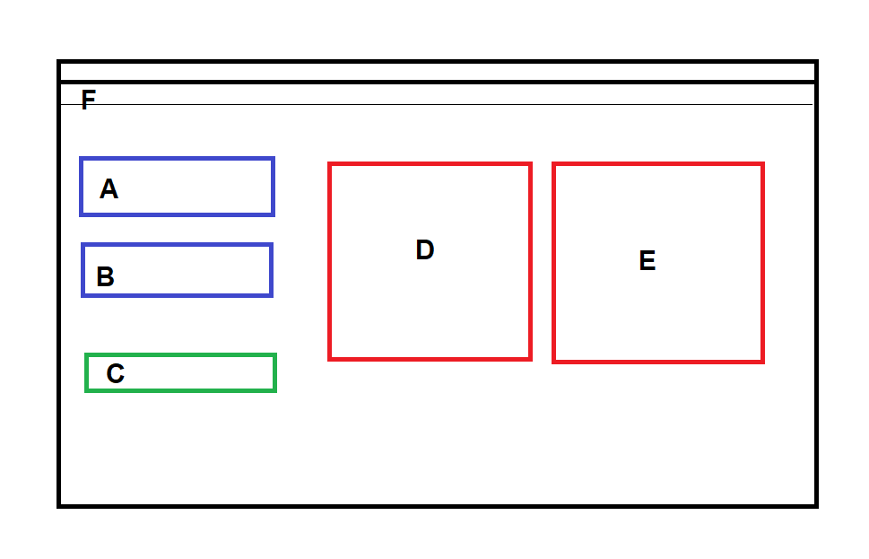

# Visión por computadora

La visión por computadora es un campo de la IA que permite que las computadoras y los sistemas obtengan información significativa de imágenes digitales, videos y otras entradas visuales, y tomen acciones o hagan recomendaciones basadas en esa información.
Si la IA permite que las computadoras piensen, la vision artificial les permite ver, observar y comprender.

Hay muchas tecnologías que utilizan la visión por ordenador, entre las cuales se encuentran el reconocimiento de objetos, la detección de sucesos, la reconstrucción de una escena y la restauración de imágenes.

# Interfaz gráfica de usuario

La interfaz gráfica de usuario, conocida también como GUI (del inglés graphical user interface), es un programa informático que actúa de interfaz de usuario, utilizando un conjunto de imágenes y objetos gráficos para representar la información y acciones disponibles en la interfaz. Su principal uso consiste en proporcionar un entorno visual sencillo para permitir la comunicación con el sistema operativo de una máquina o computador.

# Materiales

- **[Python](https://docs.python.org/3/)** es un lenguaje de programación de alto nivel, interpretado, multiparadigma y multiplataforma. Es muy popular para el desarrollo de aplicaciones de inteligencia artificial, ya que ofrece una gran variedad de bibliotecas y herramientas para facilitar el trabajo con datos, algoritmos y modelos.
- **[Numpy](https://numpy.org/doc/)** es una biblioteca de Python que proporciona soporte para trabajar con arreglos multidimensionales, operaciones matemáticas y funciones universales. Es muy útil para el procesamiento de imágenes, ya que permite manipular los píxeles y los canales de color de forma eficiente.
- **[OpenCV](https://docs.opencv.org/4.x/)** es una biblioteca de código abierto que ofrece funciones para el procesamiento de imágenes y visión por computadora. Con OpenCV se pueden realizar tareas como la detección y el reconocimiento de objetos, el seguimiento de movimiento, la transformación de perspectiva, el filtrado y la segmentación de imágenes, entre otras.
- **[PyQt6](https://doc.qt.io/qtforpython-6/)** es un conjunto de enlaces de Python para el framework Qt, que es una herramienta para crear interfaces gráficas de usuario (GUI) multiplataforma. Con PyQt6 se pueden diseñar ventanas, botones, menús, etiquetas, cuadros de diálogo y otros elementos para interactuar con el usuario.
- **Imágenes TIFF** son un formato de archivo de imagen que soporta múltiples páginas, compresión sin pérdida, metadatos y alta profundidad de color. Es un formato muy utilizado en el ámbito científico y profesional, ya que ofrece una alta calidad y fidelidad de las imágenes.

# Metodos
En el plano $\mathbb{R}^2$, un mapeo horizontal (o mapeo paralelo al eje $x$) es una funcion que toma un punto cualquiera con coordenadas $(x,y)$ al punto $(x+my, y)$, donde $m$ es un parámetro fijo denominado **factor de corte**. Algo similar sucede al realizar un mapeo vertical.

Las líneas rectas paralelas al eje $x$ permanecen en su sitio, mientras que todas las demás líneas giran, en variados ángulos, sobre el punto donde cruzan el eje $x$. Las líneas verticales, en particular, se convierten en líneas oblicuas con pendiente $1/m$. Por lo tanto,
$$m = \cot(\varphi).$$
Este ángulo 
$\varphi$  determina la inclinación de las líneas verticales. Se le denomina **ángulo de corte**.

Utilizamos transformaciones geométricas para modificar la disposición espacial de los píxeles de una imagen. 
Las transformaciones geométricas de imágenes digitales constan de dos operaciones básicas:

- Transformación espacial de coordenadas.
- Interpolación de intensidad que asigna valores de intensidad a los píxeles transformados espacialmente.

La transformación de coordenadas se puede expresar como

$$(x',y') = T \{ (x, y) \}$$

dónde $(x, y)$ son las coordenadas de los píxeles de la imagen original y $(x', y')$ corresponden a las coordenadas de los píxeles de la imagen transformada.

Por ejemplo, la transformación $(x',y')= T \{ (x, y) \} = (x/2, y/2)$ reduce la imagen a la mitad de su tamaño en ambas direcciones espaciales.

El interés principal de este proyecto son las llamadas **transformaciones afines**, las cuales incluyen scaling, translación, rotacion y en especial el **shearing**. 

La característica clave de una transformación afín en 2-D es que conserva puntos, líneas rectas y planos.  La ecuación anterior se puede utilizar para expresar las transformaciones que acabamos de mencionar, excepto la traslación, que requeriría agregar un vector bidimensional constante al lado derecho de la ecuación.  Sin embargo, es posible utilizar coordenadas homogéneas para expresar las cuatro transformaciones afines utilizando una sola matriz $3x3$ de la siguiente manera

$$
\left[\begin{array}{l}
x^{\prime} \\
y^{\prime} \\
1
\end{array}\right]=\mathbf{A}\left[\begin{array}{l}
x \\
y \\
1
\end{array}\right]=\left[\begin{array}{ccc}
a_{11} & a_{12} & a_{13} \\
a_{21} & a_{22} & a_{23} \\
0 & 0 & 1
\end{array}\right]\left[\begin{array}{l}
x \\
y \\
1
\end{array}\right]
$$

Esta transformación puede escalar, rotar, trasladar o sesgar la imagen, dependiendo de los valores de los elementos de la matriz $A$.

Una ventaja significativa de poder realizar todas las transformaciones utilizando la representación unificada en la ecuación anterior es que proporciona el marco para concatenar una secuencia de operaciones.  Por ejemplo, si queremos cambiar el tamaño de una imagen, rotarla y mover el resultado a alguna ubicación, simplemente formamos una matriz de $3 × 3$ igual al producto de las matrices de escala, rotación y traslación.

# Mockup

El siguiente _muckup_ representa la interfaz

Las partes que conforman la interfaz son

- **A** - `qdoublespinbox` para ingresar el valor del factor de corte horizontal.

- **B** - `qdoublespinbox` para ingresar el valor del factor de corte vertical.

- **C** - `qpushbutton` para aplicar el filtro dados los valores ingresados en A y B.

- **D** - `qlabel` para mostrar la imagen seleccionada

- **E** - `qlabel` para mostrar la imagen con filtro despues de usar el boton C.

- **F** - Para poder seleccionar una imagen y posteriormente guardarla.

# Interfaz

La primer imagen muestra la interfaz al ejecutar [main.py](/main.py).

La segunda imagen muesta la ventana para seleccionar una imagen despues de hacer clic en _Abrir imagen_.

La tercer imagen muestra la interfaz cuando una imagen es seleccionada.

La cuarta imagen muestra como despues de seleccionar el botón _Aplicar filtro_, la imagen aparece a un lado de la original.

La última imagen muesta como se puede guardar la imagen a la que se le aplico el filtro.

